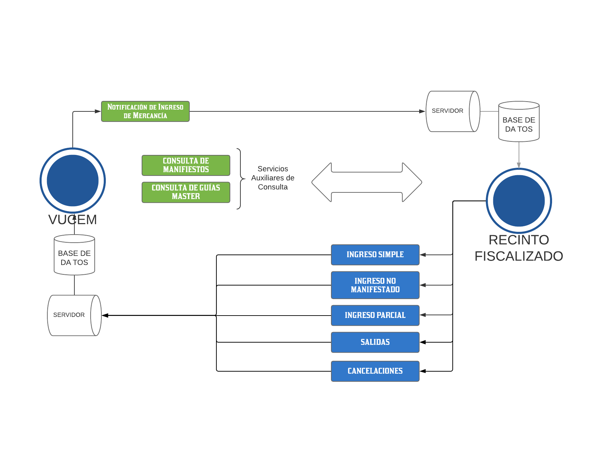

# VUCEMSIRA 3.5 #

### Información del Repositorio ###

* Repositorio implementado sobre Laravel 7 + NuSoap para el consumo del servicio web VUCEM/SIRA

### Información para el desarrollo ###



* Guía de Apoyo para Implementación SIRA Version 3.5 (Sección Recintos Fiscalizados)
* [Ver Detalles](https://www.ventanillaunica.gob.mx/vucem/descargas.html)

### Métodos Desarrollados ###

* NotificacionIngresoMercancia (Servidor)
    * Entrega un **idAsociado** por **Master** y un **consecutivo** por **House** así como la información manifestada por la aerolínea que debe recibir el recinto fiscalizado.
* ConsultaManifiestos
    * Sirve para conocer las guías máster referentes a un manifiesto declarado.
* ConsultaDetalleGuia
    * Sirve para conocer la última infomración de las guías master declaradas en un manifiesto.
* IngresoSimple
    * Si llega la **master completa, sin guías house**, se debe utilizar **IngresoSimpleMaster**.
    * Si llega la **master con guía house completa**, se debe utilizar **IngresoSimpleHouse** en la cual se deben ingresar todas las guías house sin la guía master.
* IngresoNoManifestado
    * Si llega una **master que no fue manifestada**, se debe utilizar **IngresoNoManifestado**
* IngresoParcial
    * Si llega la **master incompleta**, se debe utilizar **IngresoParcialMaster** y/o **IngresoParcialHouse** hasta completar el peso declarado en la master.

### Instalación ###

```sh
$ composer require zerobyt/sira
$ composer install
$ php artisan migrate
```
### Créditos ###

* Desarrollado por Cristian Vega @CristianVegaMx

### Licencia ###

MIT
